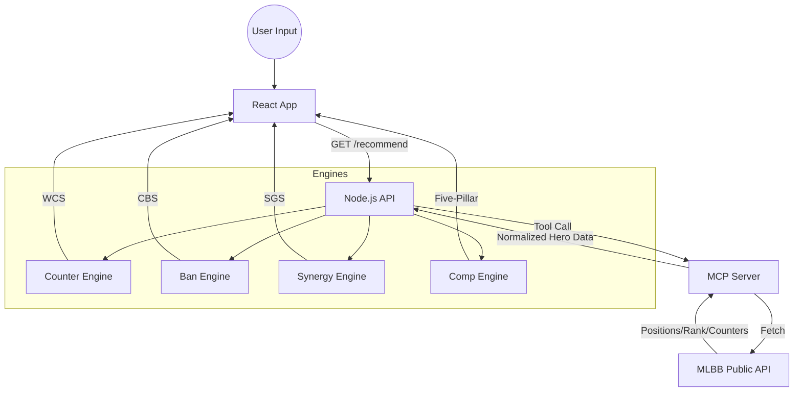
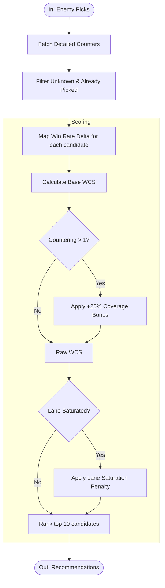
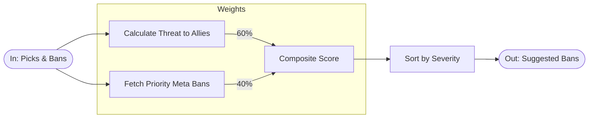
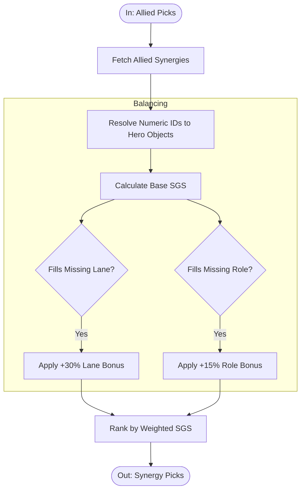
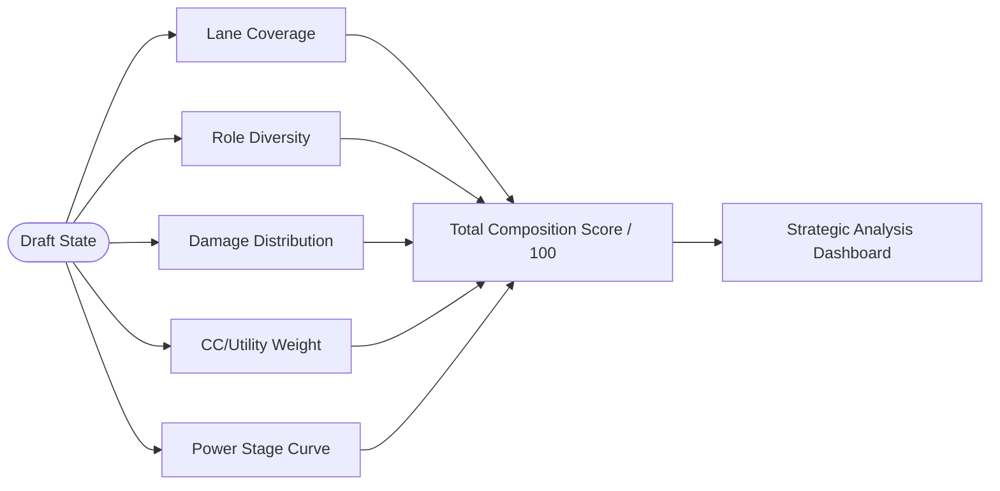

# Drafting Engine Architecture (v3.0.x)

This document outlines the technical logic and decision-making flow for the MLBB Drafting Assistant's core engines.

---

## 1. Overall System Data Flow
The system operates on a 3-layer architecture:
1. **MCP Server**: Data ingestion and normalization from MLBB Public APIs.
2. **Node.js Backend**: Logic engines (Banning, Counter, Synergy, Composition).
3. **React Frontend**: UI rendering and user interaction state.

---

## 2. Counter Picking Engine (WCS)
The Counter Engine calculates a **Weighted Counter Score (WCS)** to prioritize hero suggestions.

### Algorithm
1. **Parallel Data Fetch**: Fetches detailed counter stats (`increase_win_rate`) for all 5 enemy picks in parallel.
2. **Filtering**: Strictly filters out invalid metadata and "Unknown" hero names.
3. **Base Score**: `Base = Σ (increase_win_rate * 100)`.
4. **Coverage Bonus**: `Bonus = Base * (1 + 0.2 * (count - 1))`, where `count` is the number of enemies countered. This rewards "multi-counters".
5. **Lane Penalty**: Reduces the final score by up to 50% if the hero matches a lane already occupied by 2+ allies.

---

## 3. Ban Suggestion Engine (CBS)
The Ban Engine calculates a **Composite Ban Score (CBS)** to identify critical bans.

### Algorithm
1. **Threat Signal (60%)**: Aggregates the threat level of candidate heroes against current allied picks (using local `weak` relations).
2. **Meta Signal (40%)**: Incorporates global ban rates and win rates to identify priority meta-bans.
3. **CBS Calculation**: `CBS = (Threat * 0.6) + (MetaStrength * 0.4)`.

---

## 4. Synergy Suggestion Engine (SGS)
The Synergy Engine identifies heroes that complement the allied lineup using the **Synergy Gain Score (SGS)**.

### Algorithm
1. **Relation Mapping**: Inspects the `assist` relations of all current allied picks.
2. **Diversity Score**: Calculates how many allies a candidate hero synergizes with.
3. **Role/Lane Alignment**:
    - **Lane Bonus (+30%)**: Applied if the hero fills an unassigned lane.
    - **Role Bonus (+15%)**: Applied if the hero fills a missing team role.

---

## 5. Team Composition Engine (Five-Pillar Model)
A transparent 0-100 scoring model evaluating 5 critical team success metrics.

| Pillar | Metric | Scoring Logic |
| :--- | :--- | :--- |
| **P1** | **Lane Coverage** | 20 pts * (unique_lanes / 5). Flags missing Gold/EXP/Mid/Jungle/Roam. |
| **P2** | **Role Balance** | 20 pts - (deviation from ideal 1-per-role distribution * 4). |
| **P3** | **Damage Balance** | 20 pts * (1 - |magic_ratio - 0.4|). Optimal is ~60% Phys, 40% Magic. |
| **P4** | **CC Presence** | 20 pts base scaled by the number of high-CC roles (Tanks/Supp/Mages). |
| **P5** | **Power Curve** | 20 pts - (imbalance between Early/Mid/Late game strength). |

